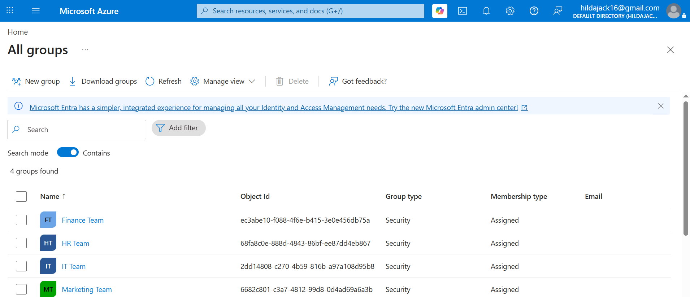
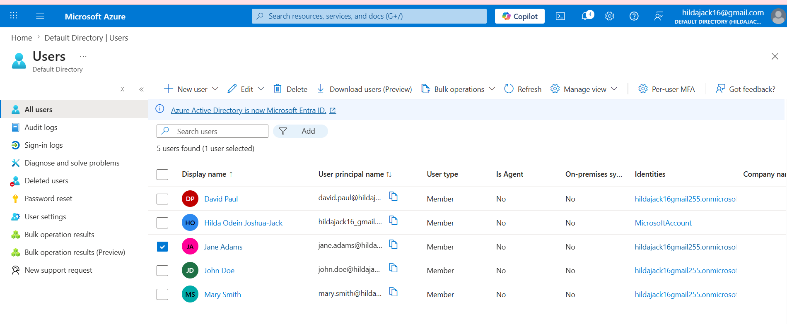
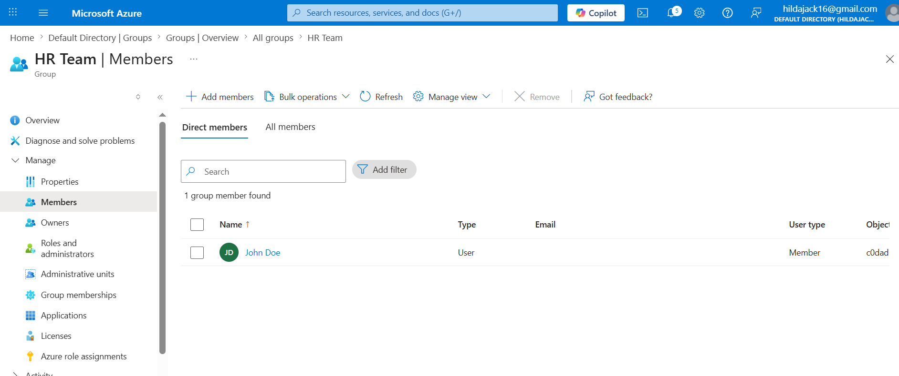
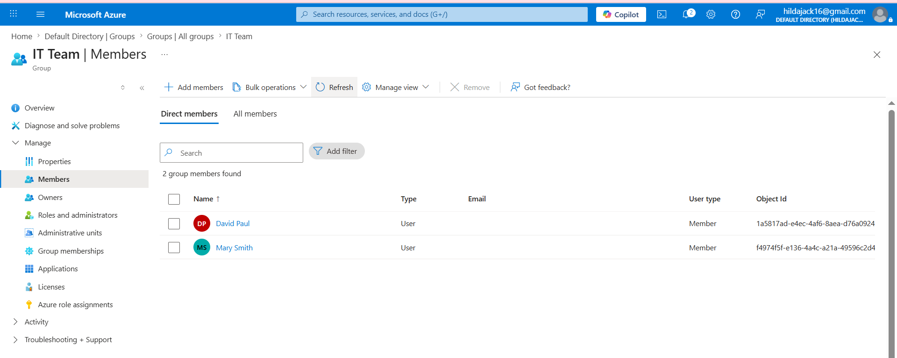
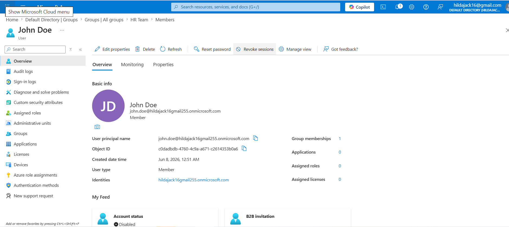

# EntraID-iam-user-lifecycle-management-lab
Identity and Access Management lab demonstrating user provisioning, role changes, and deprovisioning using Microsoft Entra ID.

# Microsoft Entra ID IAM User Lifecycle Management Lab

## Project Overview

This project demonstrates Identity and Access Management (IAM) concepts using Microsoft Entra ID (Azure Active Directory).

The objective was to simulate how an IAM Administrator manages employee identities throughout their lifecycle within an organization.

The project covers:

- User Provisioning (Joiner Process)
- User Role Changes (Mover Process)
- User Offboarding (Leaver Process)
- Group-Based Access Control
- Role-Based Access Control (RBAC)
- Least Privilege Principle

---

## Environment

Platform Used:

- Microsoft Entra ID
- Azure Portal
- GitHub

Organization:

TechNova Ltd

Departments:

- Human Resources
- Finance
- Information Technology
- Marketing

---

## Security Groups Created

The following security groups were created:

- HR-Team
- Finance-Team
- IT-Team
- Marketing-Team

These groups were used to demonstrate Role-Based Access Control (RBAC).

---

## User Provisioning

The following users were created:

| User | Department |
|--------|------------|
| John Doe | HR |
| Mary Smith | Finance |
| David Paul | IT |
| Jane Adams | Marketing |

Each user was assigned to the appropriate security group.

---

## Mover Process

Scenario:

Mary Smith transferred from Finance to IT.

Actions Performed:

- Removed from Finance-Team
- Added to IT-Team
- Verified new group membership

This demonstrated access modification during role transitions.

---

## Leaver Process

Scenario:

John Doe left the organization.

Actions Performed:

- Blocked sign-in
- Removed group membership
- Revoked access

This demonstrated secure account offboarding procedures.

---

## Security Concepts Demonstrated

### Identity and Access Management

Managing user identities throughout the employee lifecycle.

### Role-Based Access Control (RBAC)

Permissions assigned through groups instead of directly to users.

### Least Privilege

Users receive only the permissions required for their role.

### Access Governance

User access is reviewed and updated when responsibilities change.

---

## Screenshots

### Security Groups

### User Creation

### Group Assignment

### Role Change

### User Offboarding

---

## Lessons Learned

Through this project I learned:

- Microsoft Entra ID administration
- User lifecycle management
- Security group administration
- RBAC implementation
- Access governance concepts
- User provisioning and deprovisioning processes
